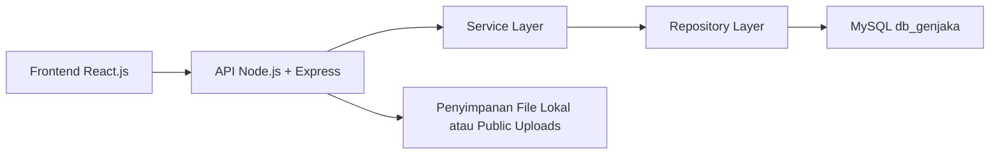
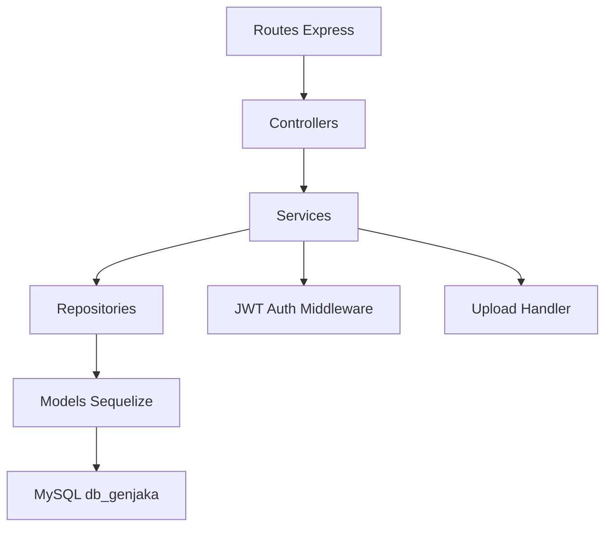
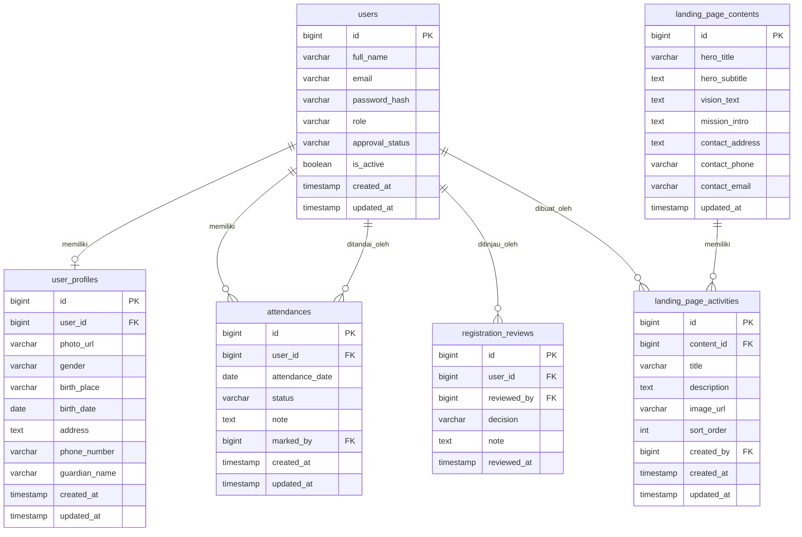

## 1. Desain Arsitektur



Arsitektur aplikasi menggunakan pola client-server. Frontend React.js menangani landing page publik, autentikasi, dan dashboard multi-role. Backend Node.js dengan Express menyediakan REST API, autentikasi berbasis JWT, logika bisnis, dan akses data ke MySQL. File foto profil dan aset landing page disimpan pada direktori upload server agar implementasi awal tetap sederhana.

## 2. Deskripsi Teknologi
- Frontend: React.js 18 + Vite + React Router + Tailwind CSS + komponen dashboard kustom dengan inspirasi Orbit Dashboard
- Inisialisasi Frontend: Vite
- Backend: Node.js + Express.js
- Autentikasi: JWT berbasis access token
- Database: MySQL (`db_genjaka`)
- ORM/Query Builder: Sequelize atau Knex; untuk implementasi awal direkomendasikan Sequelize agar struktur model lebih cepat disusun
- Upload File: Multer
- Validasi: Zod atau express-validator
- State Management Frontend: React Context + hooks untuk skala awal
- Data Fetching: Axios

## 3. Definisi Route
| Route | Tujuan |
|-------|--------|
| / | Landing page publik |
| /login | Halaman login semua role |
| /register | Halaman registrasi user |
| /dashboard | Entry route setelah login, redirect berdasarkan role |
| /dashboard/user/profile | Form biodata user |
| /dashboard/user/attendance | Riwayat absensi user |
| /dashboard/teacher/users | Data user untuk dewan guru |
| /dashboard/teacher/attendance | Input absensi user |
| /dashboard/teacher/reports | Laporan absensi |
| /dashboard/admin/users | Manajemen user |
| /dashboard/admin/teachers | Manajemen dewan guru |
| /dashboard/admin/registrations | Approval registrasi user |
| /dashboard/admin/attendance | Manajemen absensi |
| /dashboard/admin/landing-page | CMS landing page |
| /dashboard/superadmin/admins | Manajemen admin oleh superadmin |

## 4. Definisi API

### 4.1 Tipe Data Inti
```ts
type Role = "user" | "teacher" | "admin" | "superadmin";

type UserAccount = {
  id: number;
  fullName: string;
  email: string;
  passwordHash: string;
  role: Role;
  approvalStatus: "pending" | "approved" | "rejected";
  isActive: boolean;
  createdAt: string;
  updatedAt: string;
};

type UserProfile = {
  id: number;
  userId: number;
  photoUrl: string | null;
  gender: string | null;
  birthPlace: string | null;
  birthDate: string | null;
  address: string | null;
  phoneNumber: string | null;
  guardianName: string | null;
  createdAt: string;
  updatedAt: string;
};

type Attendance = {
  id: number;
  userId: number;
  attendanceDate: string;
  status: "hadir" | "izin" | "sakit" | "alpa";
  note: string | null;
  markedBy: number;
  createdAt: string;
  updatedAt: string;
};
```

### 4.2 Endpoint Auth
| Method | Endpoint | Tujuan |
|--------|----------|--------|
| POST | /api/auth/register | Registrasi akun user baru |
| POST | /api/auth/login | Login dan menerima token |
| GET | /api/auth/me | Mengambil profil akun aktif |
| POST | /api/auth/logout | Logout sisi server bila dibutuhkan |

Contoh request registrasi:
```json
{
  "fullName": "Nama User",
  "email": "user@example.com",
  "password": "rahasia123"
}
```

Contoh response login:
```json
{
  "token": "jwt-token",
  "user": {
    "id": 1,
    "fullName": "Nama User",
    "email": "user@example.com",
    "role": "user",
    "approvalStatus": "approved"
  }
}
```

### 4.3 Endpoint Profil User
| Method | Endpoint | Tujuan |
|--------|----------|--------|
| GET | /api/user/profile | Ambil biodata user aktif |
| PUT | /api/user/profile | Simpan atau ubah biodata user |
| POST | /api/user/profile/photo | Upload foto profil |
| GET | /api/user/attendance | Lihat absensi user sendiri |

### 4.4 Endpoint Dewan Guru
| Method | Endpoint | Tujuan |
|--------|----------|--------|
| GET | /api/teacher/users | Daftar user |
| GET | /api/teacher/users/:id | Detail user |
| POST | /api/teacher/attendance | Input absensi user |
| GET | /api/teacher/reports/attendance | Rekap laporan absensi |

### 4.5 Endpoint Admin
| Method | Endpoint | Tujuan |
|--------|----------|--------|
| GET | /api/admin/users | Daftar user |
| POST | /api/admin/users | Tambah user |
| PUT | /api/admin/users/:id | Ubah user |
| DELETE | /api/admin/users/:id | Hapus/nonaktifkan user |
| GET | /api/admin/teachers | Daftar dewan guru |
| POST | /api/admin/teachers | Tambah dewan guru |
| PUT | /api/admin/teachers/:id | Ubah dewan guru |
| DELETE | /api/admin/teachers/:id | Hapus/nonaktifkan dewan guru |
| GET | /api/admin/registrations | Daftar registrasi pending |
| POST | /api/admin/registrations/:id/approve | Setujui registrasi |
| POST | /api/admin/registrations/:id/reject | Tolak registrasi |
| GET | /api/admin/attendance | Daftar absensi |
| PUT | /api/admin/attendance/:id | Koreksi absensi |
| DELETE | /api/admin/attendance/:id | Hapus data absensi |
| GET | /api/admin/landing-page | Ambil konten landing page |
| PUT | /api/admin/landing-page | Simpan konten landing page |

### 4.6 Endpoint SuperAdmin
| Method | Endpoint | Tujuan |
|--------|----------|--------|
| GET | /api/superadmin/admins | Daftar admin |
| POST | /api/superadmin/admins | Tambah admin |
| PUT | /api/superadmin/admins/:id | Ubah admin |
| DELETE | /api/superadmin/admins/:id | Hapus/nonaktifkan admin |

## 5. Diagram Arsitektur Server



## 6. Model Data

### 6.1 Definisi Model Data


### 6.2 Data Definition Language
```sql
CREATE DATABASE IF NOT EXISTS db_genjaka;
USE db_genjaka;

CREATE TABLE users (
  id BIGINT UNSIGNED AUTO_INCREMENT PRIMARY KEY,
  full_name VARCHAR(150) NOT NULL,
  email VARCHAR(150) NOT NULL UNIQUE,
  password_hash VARCHAR(255) NOT NULL,
  role ENUM('user','teacher','admin','superadmin') NOT NULL DEFAULT 'user',
  approval_status ENUM('pending','approved','rejected') NOT NULL DEFAULT 'pending',
  is_active TINYINT(1) NOT NULL DEFAULT 1,
  created_at TIMESTAMP DEFAULT CURRENT_TIMESTAMP,
  updated_at TIMESTAMP DEFAULT CURRENT_TIMESTAMP ON UPDATE CURRENT_TIMESTAMP
);

CREATE TABLE user_profiles (
  id BIGINT UNSIGNED AUTO_INCREMENT PRIMARY KEY,
  user_id BIGINT UNSIGNED NOT NULL UNIQUE,
  photo_url VARCHAR(255) NULL,
  gender VARCHAR(30) NULL,
  birth_place VARCHAR(100) NULL,
  birth_date DATE NULL,
  address TEXT NULL,
  phone_number VARCHAR(30) NULL,
  guardian_name VARCHAR(150) NULL,
  created_at TIMESTAMP DEFAULT CURRENT_TIMESTAMP,
  updated_at TIMESTAMP DEFAULT CURRENT_TIMESTAMP ON UPDATE CURRENT_TIMESTAMP,
  CONSTRAINT fk_user_profiles_user
    FOREIGN KEY (user_id) REFERENCES users(id)
    ON DELETE CASCADE
);

CREATE TABLE attendances (
  id BIGINT UNSIGNED AUTO_INCREMENT PRIMARY KEY,
  user_id BIGINT UNSIGNED NOT NULL,
  attendance_date DATE NOT NULL,
  status ENUM('hadir','izin','sakit','alpa') NOT NULL,
  note TEXT NULL,
  marked_by BIGINT UNSIGNED NOT NULL,
  created_at TIMESTAMP DEFAULT CURRENT_TIMESTAMP,
  updated_at TIMESTAMP DEFAULT CURRENT_TIMESTAMP ON UPDATE CURRENT_TIMESTAMP,
  CONSTRAINT fk_attendances_user
    FOREIGN KEY (user_id) REFERENCES users(id)
    ON DELETE CASCADE,
  CONSTRAINT fk_attendances_marked_by
    FOREIGN KEY (marked_by) REFERENCES users(id)
    ON DELETE RESTRICT,
  UNIQUE KEY uk_attendance_user_date (user_id, attendance_date)
);

CREATE TABLE registration_reviews (
  id BIGINT UNSIGNED AUTO_INCREMENT PRIMARY KEY,
  user_id BIGINT UNSIGNED NOT NULL,
  reviewed_by BIGINT UNSIGNED NOT NULL,
  decision ENUM('approved','rejected') NOT NULL,
  note TEXT NULL,
  reviewed_at TIMESTAMP DEFAULT CURRENT_TIMESTAMP,
  CONSTRAINT fk_registration_reviews_user
    FOREIGN KEY (user_id) REFERENCES users(id)
    ON DELETE CASCADE,
  CONSTRAINT fk_registration_reviews_reviewer
    FOREIGN KEY (reviewed_by) REFERENCES users(id)
    ON DELETE RESTRICT
);

CREATE TABLE landing_page_contents (
  id BIGINT UNSIGNED AUTO_INCREMENT PRIMARY KEY,
  hero_title VARCHAR(200) NOT NULL,
  hero_subtitle TEXT NULL,
  vision_text TEXT NULL,
  mission_intro TEXT NULL,
  contact_address TEXT NULL,
  contact_phone VARCHAR(50) NULL,
  contact_email VARCHAR(150) NULL,
  updated_at TIMESTAMP DEFAULT CURRENT_TIMESTAMP ON UPDATE CURRENT_TIMESTAMP
);

CREATE TABLE landing_page_activities (
  id BIGINT UNSIGNED AUTO_INCREMENT PRIMARY KEY,
  content_id BIGINT UNSIGNED NOT NULL,
  title VARCHAR(150) NOT NULL,
  description TEXT NULL,
  image_url VARCHAR(255) NULL,
  sort_order INT NOT NULL DEFAULT 0,
  created_by BIGINT UNSIGNED NULL,
  created_at TIMESTAMP DEFAULT CURRENT_TIMESTAMP,
  updated_at TIMESTAMP DEFAULT CURRENT_TIMESTAMP ON UPDATE CURRENT_TIMESTAMP,
  CONSTRAINT fk_landing_page_activities_content
    FOREIGN KEY (content_id) REFERENCES landing_page_contents(id)
    ON DELETE CASCADE,
  CONSTRAINT fk_landing_page_activities_creator
    FOREIGN KEY (created_by) REFERENCES users(id)
    ON DELETE SET NULL
);

CREATE INDEX idx_users_role ON users(role);
CREATE INDEX idx_users_approval_status ON users(approval_status);
CREATE INDEX idx_attendances_date ON attendances(attendance_date);
CREATE INDEX idx_registration_reviews_user ON registration_reviews(user_id);

INSERT INTO users (full_name, email, password_hash, role, approval_status, is_active)
VALUES (
  'Super Admin',
  'superadmin@genjaka.local',
  '$2b$10$replace_with_bcrypt_hash',
  'superadmin',
  'approved',
  1
);

INSERT INTO landing_page_contents (
  hero_title,
  hero_subtitle,
  vision_text,
  mission_intro,
  contact_address,
  contact_phone,
  contact_email
) VALUES (
  'Portal Genjaka',
  'Platform publik dan administrasi terpadu untuk pengelolaan profil lembaga, registrasi, dan absensi.',
  'Menjadi lembaga yang unggul, tertib, dan adaptif dalam pengelolaan pendidikan serta pembinaan peserta.',
  'Misi utama lembaga ditampilkan dan dapat dikelola melalui CMS Admin.',
  'Alamat lembaga',
  '0812-0000-0000',
  'info@genjaka.local'
);
```

## 7. Keputusan Implementasi Awal
- Frontend dan backend dipisahkan ke dalam folder `frontend` dan `backend`.
- Backend menyediakan endpoint REST dan direktori `uploads` untuk foto profil serta aset kegiatan.
- Hak akses diterapkan melalui middleware `authenticate` dan `authorize(role[])`.
- Konten landing page dibuat dinamis sejak awal agar admin dapat mengelola bagian Home, Visi, Misi, Kegiatan, dan Hubungi tanpa edit kode.
- Desain dashboard mengikuti pola sidebar + topbar seperti Orbit, tetapi tetap menggunakan identitas visual Genjaka agar tidak tampak generik.
