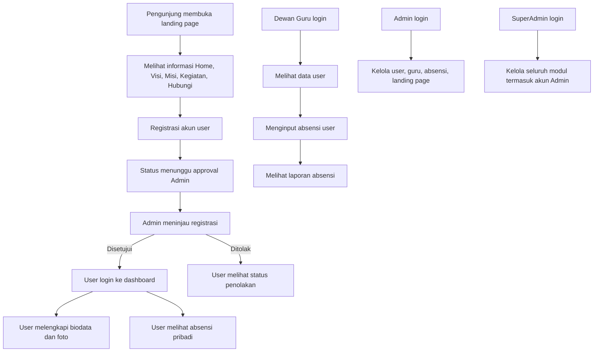

## 1. Gambaran Produk
Portal Genjaka adalah aplikasi web berbasis React.js dan Node.js untuk menghadirkan landing page publik yang menarik sekaligus sistem administrasi internal dengan pengelolaan user, guru, absensi, dan konten situs.
- Produk ini ditujukan untuk lembaga pendidikan/organisasi yang membutuhkan wajah digital publik dan panel operasional internal dalam satu ekosistem.
- Nilai utamanya adalah penyederhanaan proses registrasi, pengelolaan biodata, pencatatan absensi, pelaporan, dan administrasi multi-role dengan kontrol akses yang jelas.

## 2. Fitur Inti

### 2.1 Peran Pengguna
| Role | Metode Registrasi | Hak Akses Inti |
|------|-------------------|----------------|
| User | Registrasi mandiri melalui halaman publik | Mengisi biodata, unggah foto profil, melihat absensi sendiri, melihat status akun |
| Dewan Guru | Dibuat oleh Admin/SuperAdmin | Melihat data user, melakukan absensi user, melihat laporan absensi |
| Admin | Dibuat oleh SuperAdmin | Mengelola user dan dewan guru, mengelola absensi, approval registrasi user, mengelola landing page |
| SuperAdmin | Seed awal sistem | Semua hak akses Admin ditambah mengelola akun Admin |

### 2.2 Modul Fitur
1. **Landing Page Publik**: navigasi utama, hero section, profil lembaga, visi, misi, kegiatan, kontak, CTA login dan registrasi.
2. **Autentikasi**: login, registrasi user, status approval registrasi, logout, proteksi route berdasarkan role.
3. **Dashboard User**: biodata pribadi, unggah foto, detail data diri, riwayat absensi.
4. **Dashboard Dewan Guru**: daftar user, input absensi, rekap absensi, filter laporan.
5. **Dashboard Admin**: manajemen user, manajemen dewan guru, approval registrasi, kelola absensi, kelola konten landing page.
6. **Dashboard SuperAdmin**: seluruh fitur Admin, plus manajemen akun Admin.
7. **CMS Landing Page**: edit teks hero, visi, misi, daftar kegiatan, kontak, CTA, dan aset visual.

### 2.3 Detail Halaman
| Nama Halaman | Nama Modul | Deskripsi Fitur |
|--------------|-------------|-----------------|
| Landing Page | Header Navigasi | Menu Home, Visi, Misi, Kegiatan, Hubungi, Login, Registrasi dengan smooth scroll |
| Landing Page | Hero Section | Judul utama, subjudul, CTA, visual utama, highlight statistik singkat |
| Landing Page | Visi | Menampilkan pernyataan visi dengan desain editorial yang kuat |
| Landing Page | Misi | Menampilkan daftar misi dalam kartu atau panel informatif |
| Landing Page | Kegiatan | Menampilkan daftar kegiatan unggulan, foto, dan deskripsi singkat |
| Landing Page | Hubungi | Informasi alamat, nomor kontak, email, formulir singkat atau CTA WhatsApp |
| Login | Form Login | Input email/username, password, validasi, pesan error, redirect sesuai role |
| Registrasi | Form Registrasi | Data akun awal user, upload dokumen/foto dasar, status menunggu approval |
| Dashboard User | Ringkasan Akun | Menampilkan status approval, profil singkat, statistik absensi |
| Dashboard User | Biodata | Form data diri lengkap, unggah foto, edit profil |
| Dashboard User | Absensi Saya | Tabel absensi pribadi dengan filter tanggal dan status |
| Dashboard Dewan Guru | Data User | Tabel daftar user dengan pencarian dan detail biodata |
| Dashboard Dewan Guru | Input Absensi | Form atau tabel absensi harian untuk user |
| Dashboard Dewan Guru | Laporan Absensi | Rekap absensi berdasarkan rentang tanggal, status, dan user |
| Dashboard Admin | Manajemen User | CRUD user, reset status, aktivasi/nonaktif akun |
| Dashboard Admin | Manajemen Dewan Guru | CRUD akun dewan guru dan pengaturan hak akses |
| Dashboard Admin | Approval Registrasi | Menyetujui atau menolak registrasi user beserta catatan |
| Dashboard Admin | Manajemen Absensi | Koreksi, tambah, ubah, dan hapus data absensi |
| Dashboard Admin | CMS Landing Page | Mengubah konten halaman publik, banner, kegiatan, dan kontak |
| Dashboard SuperAdmin | Manajemen Admin | CRUD akun admin dan pengaturan status akun |

## 3. Proses Inti
Alur utama dimulai dari pengunjung yang melihat landing page publik, lalu melakukan registrasi sebagai user. Setelah direview Admin, akun user disetujui dan dapat login untuk mengisi biodata serta melihat absensi. Dewan Guru melakukan absensi dan mengakses laporan. Admin mengelola data user, guru, absensi, approval registrasi, dan konten landing page. SuperAdmin memiliki kontrol penuh termasuk pengelolaan akun Admin.

## 4. Desain Antarmuka Pengguna

### 4.1 Gaya Desain
- Warna utama: biru malam, emas lembut, putih hangat, dan aksen teal untuk kesan akademik modern.
- Gaya tombol: rounded medium dengan efek glow halus dan transisi hover tegas.
- Tipografi: font display berkarakter untuk heading dan font sans modern yang rapi untuk isi.
- Gaya layout: desktop-first, kombinasi section editorial untuk landing page dan dashboard modular bergaya admin modern seperti referensi Orbit.
- Gaya ikon: outline icon yang bersih dengan aksen badge status untuk role, approval, dan absensi.

### 4.2 Ringkasan Desain Halaman
| Nama Halaman | Nama Modul | Elemen UI |
|--------------|-------------|-----------|
| Landing Page | Hero Section | Layout dua kolom, headline besar, CTA kontras, statistik singkat, ornamen latar |
| Landing Page | Visi & Misi | Komposisi blok konten yang rapi dengan aksen garis dan kartu informatif |
| Landing Page | Kegiatan | Grid kartu kegiatan dengan gambar, hover, dan ringkasan singkat |
| Landing Page | Hubungi | Panel kontak, peta/placeholder lokasi, CTA komunikasi |
| Login/Registrasi | Form Auth | Card auth elegan dengan validasi jelas dan ilustrasi pendukung |
| Dashboard Semua Role | Sidebar dan Header | Sidebar tetap, topbar informatif, badge role, breadcrumb, quick actions |
| Dashboard User | Biodata & Absensi | Form profil tersegmentasi, upload foto, tabel absensi responsif |
| Dashboard Guru/Admin | Data Table | Tabel dengan pencarian, filter, pagination, modal/form inline |
| CMS Landing Page | Editor Konten | Form per section, preview, pengelolaan daftar kegiatan dan informasi kontak |

### 4.3 Responsivitas
- Pendekatan utama adalah desktop-first sesuai kebutuhan dashboard administrasi.
- Landing page tetap dioptimalkan untuk tablet dan mobile dengan navigasi collapse dan susunan section vertikal.
- Dashboard pada mobile menggunakan drawer sidebar, tabel scroll horizontal, dan komponen kartu untuk ringkasan utama.
